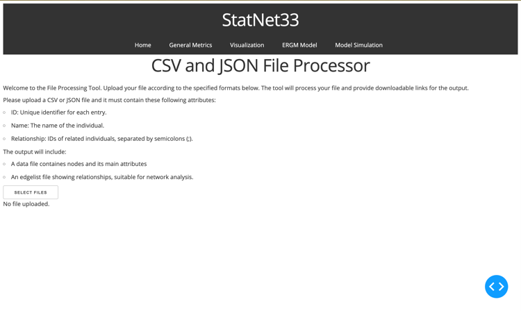
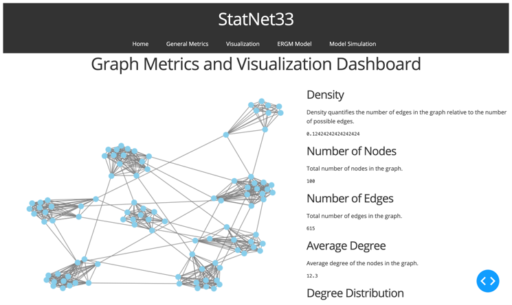
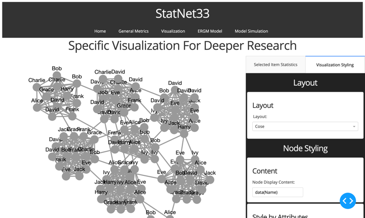
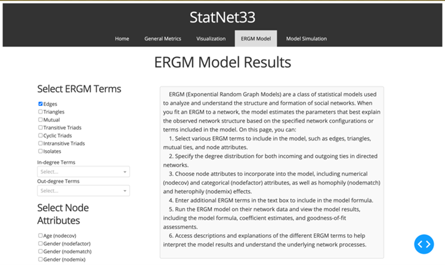
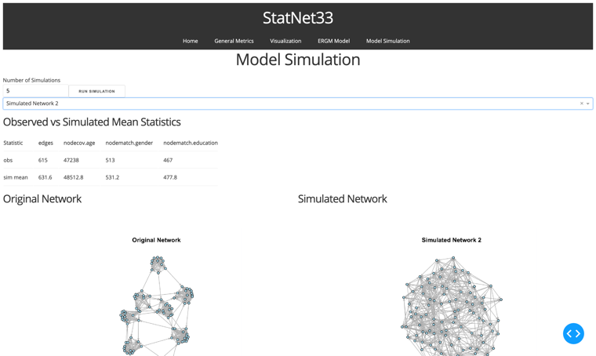

<!-- Improved compatibility of back to top link: See: https://github.com/othneildrew/Best-README-Template/pull/73 -->

<a name="readme-top"></a>

<!--
*** Thanks for checking out the Best-README-Template. If you have a suggestion
*** that would make this better, please fork the repo and create a pull request
*** or simply open an issue with the tag "enhancement".
*** Don't forget to give the project a star!
*** Thanks again! Now go create something AMAZING! :D
-->

<!-- PROJECT SHIELDS -->
<!--
*** I'm using markdown "reference style" links for readability.
*** Reference links are enclosed in brackets [ ] instead of parentheses ( ).
*** See the bottom of this document for the declaration of the reference variables
*** for contributors-url, forks-url, etc. This is an optional, concise syntax you may use.
*** https://www.markdownguide.org/basic-syntax/#reference-style-links
-->

[![Contributors][contributors-shield]][contributors-url]
[![Forks][forks-shield]][forks-url]
[![Stargazers][stars-shield]][stars-url]
[![Issues][issues-shield]][issues-url]
[![MIT License][license-shield]][license-url]
[![LinkedIn][linkedin-shield]][linkedin-url]

<!-- PROJECT LOGO -->
<br />
<div align="center">
  <a href="https://github.com/leocomsci/Statnet33">
    
  </a>

<h3 align="center">A Social Network Analyzer application with a flexible and user-friendly, cross-platform tool for social network analysis and visualisation</h3>

  <p align="center">
    Web application
    <br />
    <br />
    <a href="https://github.com/leocomsci/Statnet33/issues">Report Bug or Request Feature</a>
  </p>
</div>

<!-- TABLE OF CONTENTS -->
<details>
  <summary>Table of Contents</summary>
  <ol>
    <li>
      <a href="#about-the-project">About The Project</a>
      <ul>
        <li><a href="#built-with">Built With</a></li>
      </ul>
    </li>
    <li><a href="#setup">Setup</a></li>
    <li><a href="#usage">Usage</a></li>
    <li><a href="#contributing">Contributing</a></li>
    <li><a href="#license">License</a></li>
    <li><a href="#contact">Contact</a></li>
    <li><a href="#acknowledgments">Acknowledgments</a></li>
  </ol>
</details>

<!-- ABOUT THE PROJECT -->

## About The Project

<div align="center">
  
</div>

StatNet33 is a Social Network Analyzer project to build a flexible and user-friendly, cross-platform tool for social network analysis and visualisation. It is developed in Python and R, which can run on both Windows and macOS. The app features an intuitive and user-friendly interface that guides users through the analysis process. It offers interactive controls and tooltips to assist users in navigating functionalities. The web application offers a set of features and capabilities to facilitate social network analysis:

- Users can easily upload network data in common formats such as CSV or JSON. The application provides validation tools to ensure data integrity.
- A wide range of network cohesion statistics to summarize and characterize the properties of the uploaded network. These statistics include measures of centrality, connectivity, density, and more.
- Networks can be visualised using interactive and customizable graph layouts provided by Dash Cytoscape. The application supports various styles, colours, and labelling options to enhance the visual representation of the network.
- The app utilised Exponential Random Graph Models (ERGM) to analyse the structural patterns and associated factors in the network. Users can use ERGM models to assess model fit and interpret the results.

<p align="right">(<a href="#readme-top">back to top</a>)</p>

### Built With


<p align="right">(<a href="#readme-top">back to top</a>)</p>

<!-- GETTING STARTED -->

## Setup

1. Clone or [download](https://github.com/leocomsci/Statnet33/archive/refs/heads/main.zip) the repo.
2. Download and install Python from the [official website](https://www.python.org). Make sure to add Python to your system's PATH environment variable during the installation process.

- Install required Python packages listed in the requirements.txt file by running `pip3 install -r requirements.txt.

3. Download and install R from the [official website](https://www.r-project.org). Follow the installation instructions specific to your operating system.

- Required R Packages: Install any required R packages listed in the `install_packages.R` script by running `source("install_packages.R")` in your R console.
- For Windows users: You will need to set the R_HOME and R_LIBS environment variable to your R installation directory. This code snippet is included at the top of the ergm.py, located in the pages folder. For example:
  ` os.environ['R_HOME'] = 'C:\\Program Files\\R\\R-[version]'`

  ` os.environ['R_LIBS'] = 'C:\\Program Files\\R\\R-[version]\\library'`
  You can replace the path to your R installation directory on Windows accordingly.

- For macOS users: You can set environment variables using the terminal using the export command. For example:

  ```sh
  export R_HOME=/Library/Frameworks/R.framework/Resources`
  ```

1. Clone or [download](https://github.com/leocomsci/Statnet33/archive/refs/heads/main.zip) the repo.
2. Download the pre-trained word embeddings from Google News Word2Vec, unzip and put the .bin file in the main folder.

- HuggingFace: https://huggingface.co/NathaNn1111/word2vec-google-news-negative-300-bin
- Google Drive (zip): https://drive.google.com/file/d/154QtCXQWAMNS46v9kxjAMm3zq2fRnIVm/view?usp=sharing
- Alternative Google Drive link: https://drive.google.com/file/d/1QsLGJwOWkNoekIASH0cCar07vaoYZN33/view?usp=sharing

3. Install required packages
   All packages use:
   1. **pandas**: For data manipulation and analysis.
   2. **numpy**: For numerical operations and arrays.
   3. **gensim**: For Word2Vec model usage.
   4. **scikit-learn**: For machine learning tasks, including classifiers, evaluation metrics, and preprocessing tools.
   5. **nltk**: For natural language processing tasks, such as text tokenization and stopword removal.
   6. **string**: Python standard library for string operations.
   7. **keras**: For deep learning models, including the Convolutional Neural Network (CNN) in your code.
   8. **transformers**: For working with pre-trained models from HuggingFace (used for summarization).
   9. **tensorflow**: Required for Keras and deep learning models.
   10. **flask** or **streamlit**: For developing web applications (if used).

```sh
export R_LIBS=/Library/Frameworks/R.framework/Versions/[version]/Resources/library
```

Or We can use code snippet that is also included for MacOs users:

` os.environ['R_HOME'] = '/Library/Frameworks/R.framework/Resources'`

`os.environ['R_LIBS'] = '/Library/Frameworks/R.framework/Versions/[version]/Resources/library'`

4. After making sure that Python and R have what it needs, StatNet33 can be accessed by opening the preferred web browser (e.g., Google Chrome, Mozilla Firefox, Safari).

- If users use Windows, users can double-click to run the `run_app.bat` file, which is a script containing commands, written in plain text that can be executed in Windows commands or programs with command-like interfaces.
- Else, if users are running macOS, then users can use `run_app.sh`. Users can make the file executable with

```sh
chmod +x run_app.sh
```

and then run it from the terminal using

```sh
./run_app.sh
```

- Alternatively, you can always choose to run our `app.py` from a terminal, an IDE, or a code editor that support Python environments.

<p align="right">(<a href="#readme-top">back to top</a>)</p>

<!-- USAGE EXAMPLES -->

## Usage

The project's primary usage is for social network analysis. In details:

- Users can easily upload network data in common formats such as CSV or JSON. The application provides validation tools to ensure data integrity. See more information in section 5, Data Processing.
- A wide range of network cohesion statistics to summarize and characterize the properties of the uploaded network. These statistics include measures of centrality, connectivity, density, and more. Read more in section 6, Network Descriptive Statistics.
- Networks can be visualised using interactive and customizable graph layouts provided by Dash Cytoscape. The application supports various styles, colours, and labelling options to enhance the visual representation of the network. Read details in section 7, Network Visualisation.
- The app utilised Exponential Random Graph Models (ERGM) to analyse the structural patterns and associated factors in the network. Users can use ERGM models to assess model fit and interpret the results. See more in section 8, Statistical Models.

### Example

<div align="center">
  
</div>

<div align="center">
  
</div>

<div align="center">
  
</div>

<div align="center">
  
</div>

<div align="center">
  
</div>

<p align="right">(<a href="#readme-top">back to top</a>)</p>

<!-- CONTRIBUTING -->

## Contributing

Contributions are what make the open source community such an amazing place to learn, inspire, and create. Any contributions you make are **greatly appreciated**.

If you have a suggestion that would make this better, please fork the repo and create a pull request. You can also simply open an issue with the tag "enhancement".
Don't forget to give the project a star! Thanks again!

1. Fork the Project
2. Create your Feature Branch (`git checkout -b feature/AmazingFeature`)
3. Commit your Changes (`git commit -m 'Add some AmazingFeature'`)
4. Push to the Branch (`git push origin feature/AmazingFeature`)
5. Open a Pull Request

<p align="right">(<a href="#readme-top">back to top</a>)</p>

<!-- LICENSE -->

## License

Distributed under the MIT License. See [LICENSE](LICENSE) for more information.

<p align="right">(<a href="#readme-top">back to top</a>)</p>

<!-- CONTACT -->

## Contact

Duc Phat Nguyen - [104203829@student.swin.edu.au](mailto:104203829@student.swin.edu.au)
Thi Thanh Thuy Tran - [103514782@student.swin.edu.au](mailto:103514782@student.swin.edu.au)
Hoa Ngoc Vu - [104188285@student.swin.edu.au](mailto:104188285@student.swin.edu.au)
A Luan Luong - [104479251@student.swin.edu.au](mailto:104479251@student.swin.edu.au)
Viet Hoang Lai - [104350042@student.swin.edu.au](mailto:104350042@student.swin.edu.au)

Project Link: [https://github.com/leocomsci/Statnet33](https://github.com/leocomsci/Statnet33)

<p align="right">(<a href="#readme-top">back to top</a>)</p>

<!-- ACKNOWLEDGMENTS -->

## Acknowledgments

I would like to express my gratitude to [Dr. Peng Wang](https://scholar.google.com/citations?hl=en&user=FWgnwbIAAAAJ) and [Dr. Eureka Priyadarshani](https://www.linkedin.com/in/eureka-priyadarshani-50ab409a/?originalSubdomain=au) for their invaluable guidance and mentorship throughout the project. I also would like to thank my team members for their support, contributions to this project, and for being good friends.

<p align="right">(<a href="#readme-top">back to top</a>)</p>

<!-- MARKDOWN LINKS & IMAGES -->
<!-- https://www.markdownguide.org/basic-syntax/#reference-style-links -->

[contributors-shield]: https://img.shields.io/github/contributors/leocomsci/Statnet33.svg?style=for-the-badge
[contributors-url]: https://github.com/leocomsci/Statnet33/graphs/contributors
[forks-shield]: https://img.shields.io/github/forks/leocomsci/Statnet33.svg?style=for-the-badge
[forks-url]: https://github.com/leocomsci/Statnet33/network/members
[stars-shield]: https://img.shields.io/github/stars/leocomsci/Statnet33.svg?style=for-the-badge
[stars-url]: https://github.com/leocomsci/Statnet33/stargazers
[issues-shield]: https://img.shields.io/github/issues/leocomsci/Statnet33.svg?style=for-the-badge
[issues-url]: https://github.com/leocomsci/Statnet33/issues
[license-shield]: https://img.shields.io/github/license/leocomsci/Statnet33.svg?style=for-the-badge
[license-url]: https://github.com/leocomsci/Statnet33/blob/master/LICENSE.txt
